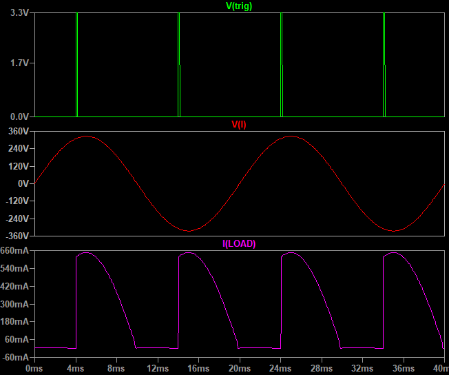

## Full Bridge Rectifier, Half-Controlled, Single-Phase
Note: MOC302x series have no zero-cross  
Note: MOC304x series have zero-cross  

### Picture
v2.0  

### Simulate
v2.0, Schematic  

v2.0, Plot  

### More Information
**Note**: [You can go here to download a single folder or file from GitHub.com](https://minhaskamal.github.io/DownGit/#/home)  
My GitHub Account: [GitHub.com/AliRezaJoodi](https://github.com/AliRezaJoodi)  