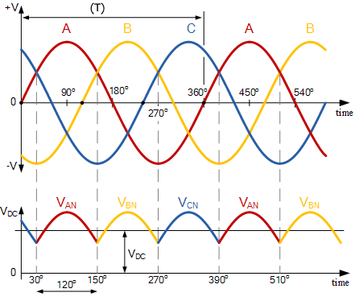
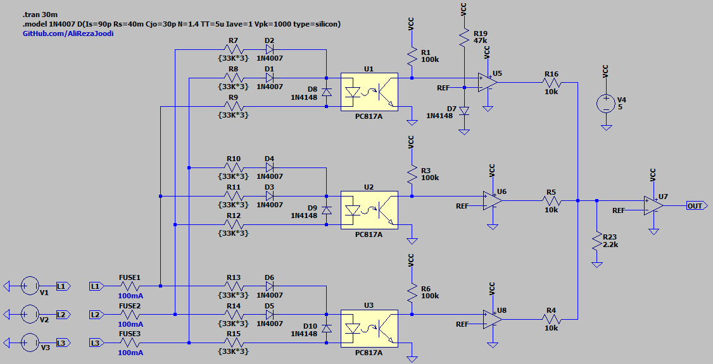
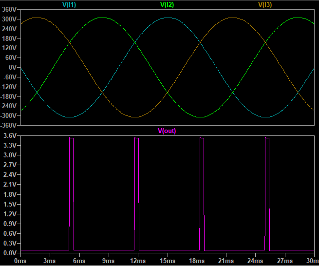

## Phase Angle Detector, 3-Phase, Optically Isolated

### Features
- **AC Input Protection:** Fuse
- **Isolation Type:** Optical
- **Isolation IC:** PC817 x3
- **Detection Level:** Falling-edge
- **Phase Angle Detection Range:** 30° to 150°
- **Power Supply:** 5V

Warning: If one of the phases is missing, the circuit cannot detect the angle correctly and the output will be invalid.
Note: Hardware testing is pending. The design has not been verified under real operating conditions.

### Simulate
v1.0, Schematic  

v1.0, Plot  

### More Information
**Note**: [You can go here to download a single folder or file from GitHub.com](https://minhaskamal.github.io/DownGit/#/home)  
My GitHub Account: [GitHub.com/AliRezaJoodi](https://github.com/AliRezaJoodi)  
