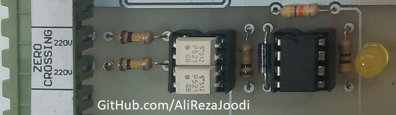
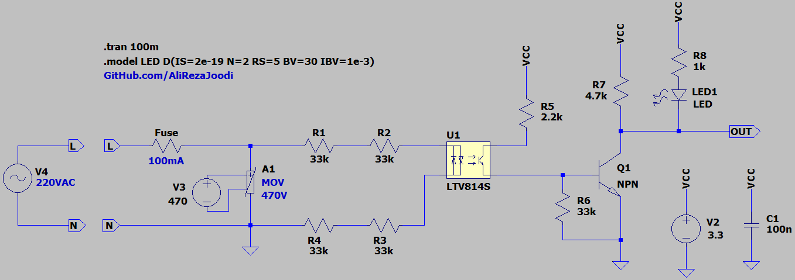
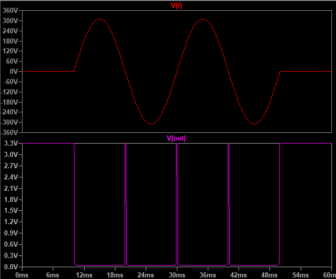

## Zero Crossing Detector, Single-Phase, Isolated

### Picture
v2.0  

### Features, v3.1
- **AC Input Protection:** Fuse + MOV
- **Isolation Type:** Optical
- **Isolation IC:** LTV814
- **Detection Level:** Falling-edge
- **Display:** LED indicator
- **Power Supply:** 3.3V

### Simulate
v3.1, Schematic  

v3.1, Plot  

### More Information
**Note**: [You can go here to download a single folder or file from GitHub.com](https://minhaskamal.github.io/DownGit/#/home)  
My GitHub Account: [GitHub.com/AliRezaJoodi](https://github.com/AliRezaJoodi)  
