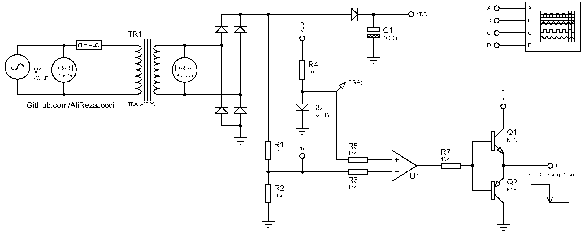
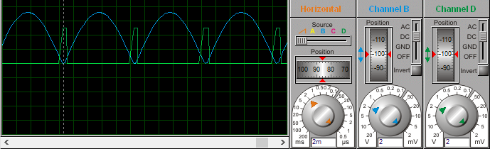
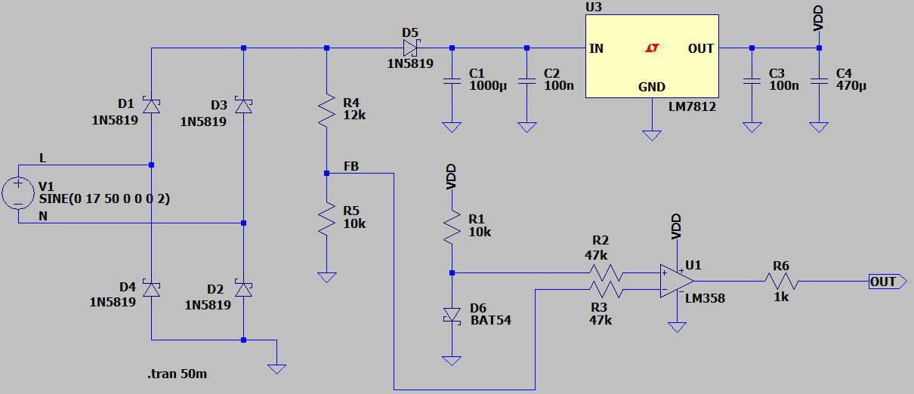
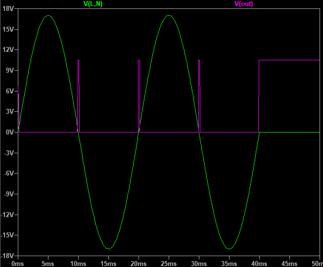

## Zero Crossing Detector, 1-Phase Dimmer, Non-isolated, Based on OpAmp

### Simulate
v1.0  

### Simulate
v1.0., Schematic  

v1.0., Plot  

### More Information
**Note**: [You can go here to download a single folder or file from GitHub.com](https://minhaskamal.github.io/DownGit/#/home)  
My GitHub Account: [GitHub.com/AliRezaJoodi](https://github.com/AliRezaJoodi)  