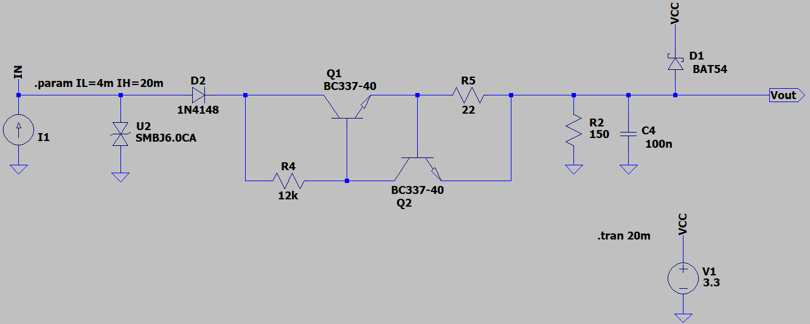
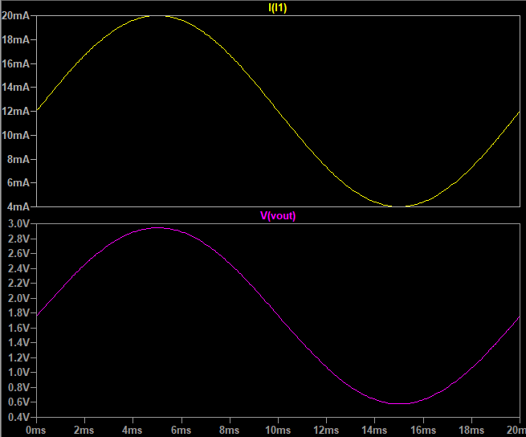
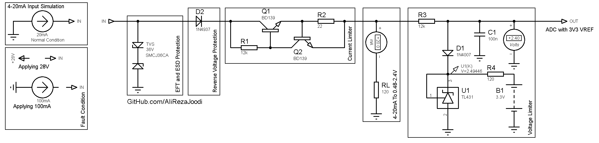

## Protected 4~20mA Analog Input

### Simulate
v1.1, Schematic  

v1.1, Plot  

v1.0, Schematic  

### More Information
Source Link: [Jeferson Pehls](https://www.linkedin.com/feed/update/urn:li:activity:7042709425547001856/)  

**Note**: [You can go here to download a single folder or file from GitHub.com](https://minhaskamal.github.io/DownGit/#/home)  
My GitHub Account: [GitHub.com/AliRezaJoodi](https://github.com/AliRezaJoodi)  

