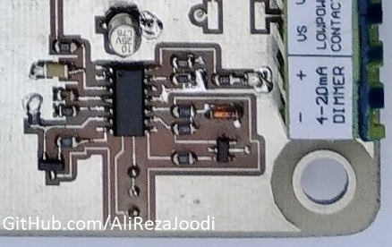
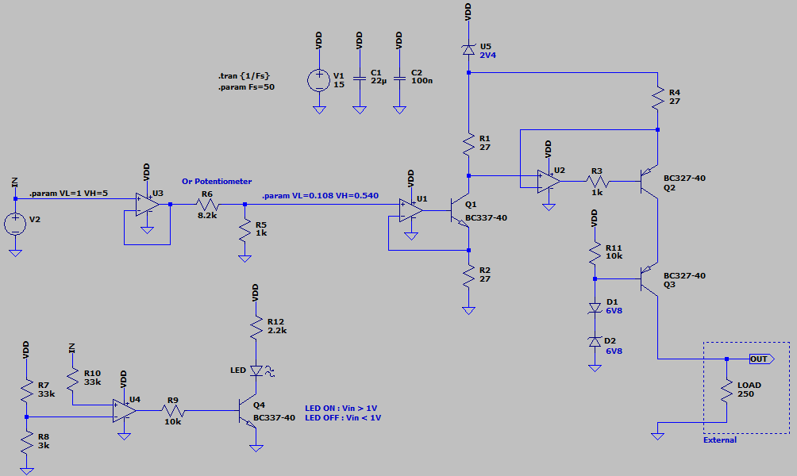
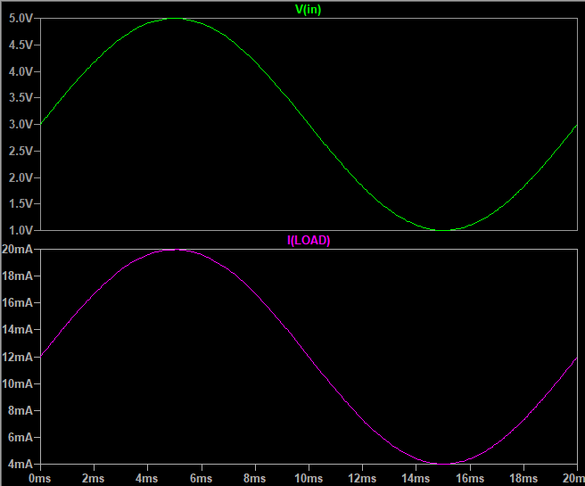
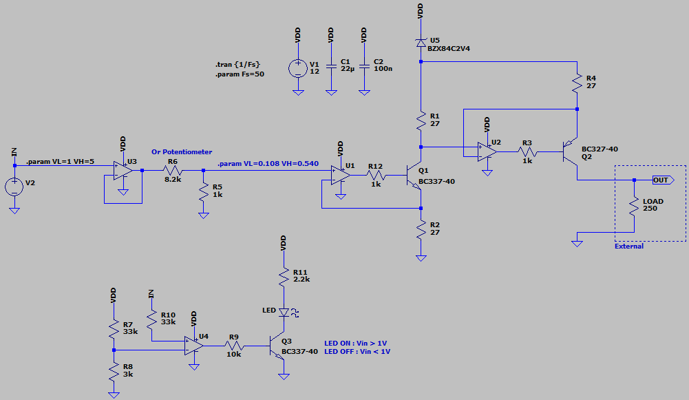
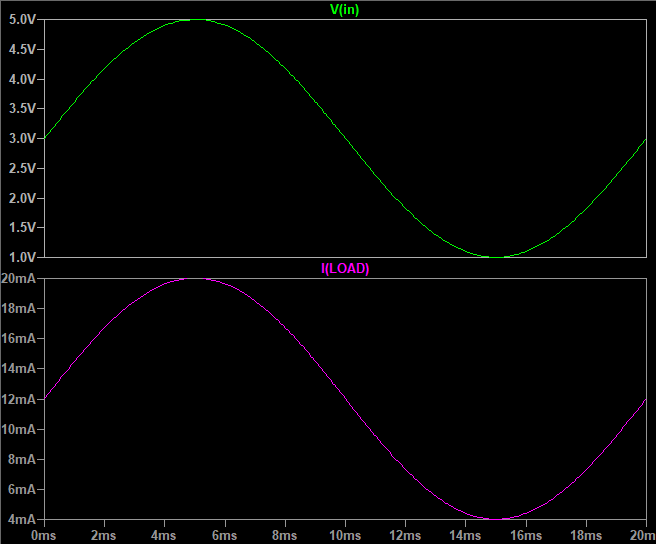
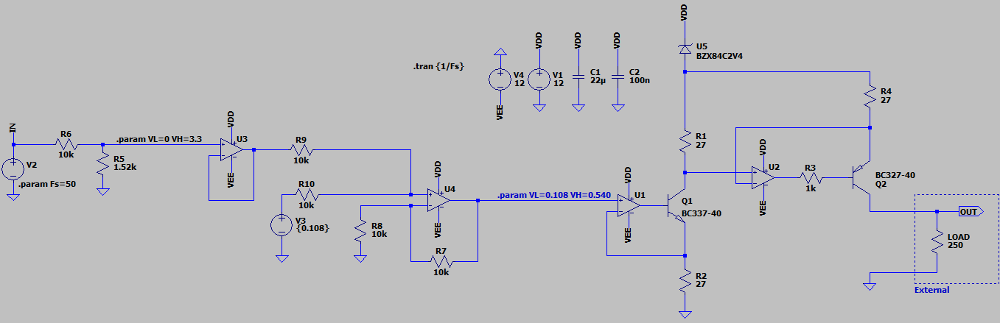
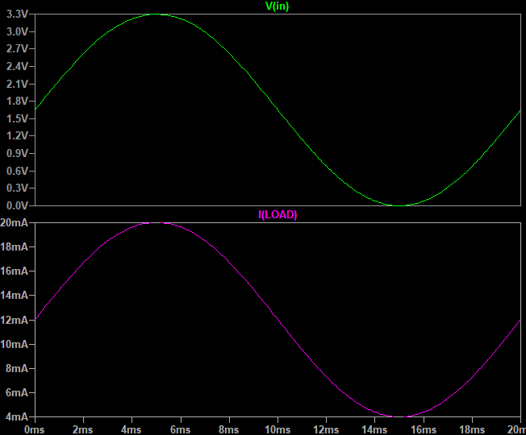

## Voltage To Current Converter

### Picture, 1-5V To 4-20mA
v1.0  

### Simulate, 1-5V To 4-20mA
v2.0, Schematic  

v2.0, Plot  

v1.0, Schematic  

v1.0, Plot  

### Simulate, 0-3.3V To 4-20mA
v1.0, Schematic  

v1.0, Plot  

### More Information
**Note**: [You can go here to download a single folder or file from GitHub.com](https://minhaskamal.github.io/DownGit/#/home)  
My GitHub Account: [GitHub.com/AliRezaJoodi](https://github.com/AliRezaJoodi)  
