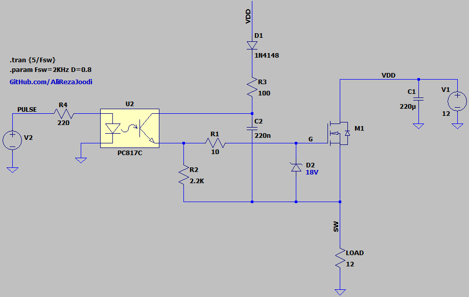
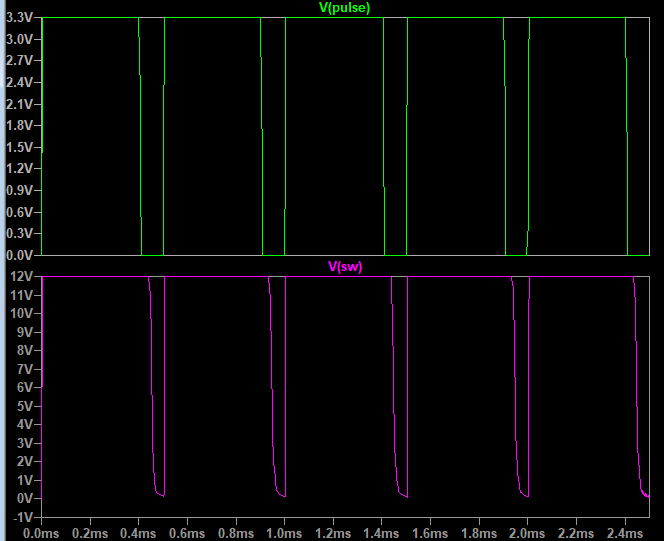

## Boot Strap for Gate Driver
This circuit is essential when using a high-side N-Channel MOSFET.  
It provides the necessary voltage to fully turn on the MOSFET in high-side configurations.  

Note: This schematic is very slow. It's better to use specialized drivers.

### Simulate
v1.0, Schematic  
  

v1.0, Plot  

My GitHub: [GitHub.com/AliRezaJoodi](https://github.com/AliRezaJoodi)  
**Note**: [You can go here to download a single folder or file from GitHub.com](https://minhaskamal.github.io/DownGit/#/home)