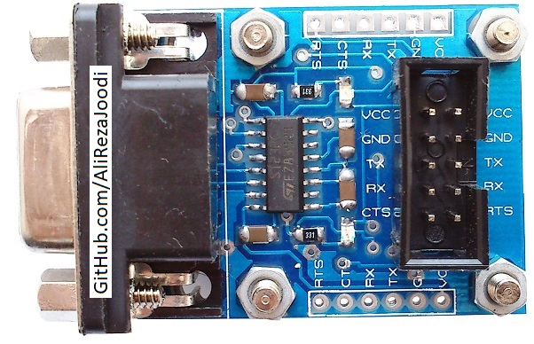
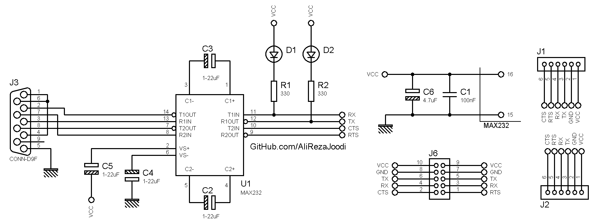

## TTL UART to RS232 Converter Using MAX232
It's Double Layer PCB  

### Picture
v1.0  

### Schematic
v1.0  

My GitHub: [GitHub.com/AliRezaJoodi](https://github.com/AliRezaJoodi)  
**Note**: [You can go here to download a single folder or file from GitHub.com](https://minhaskamal.github.io/DownGit/#/home)
