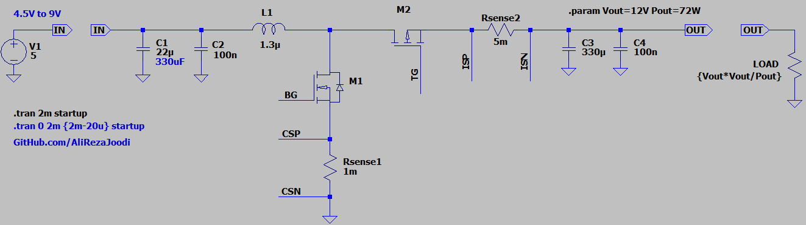
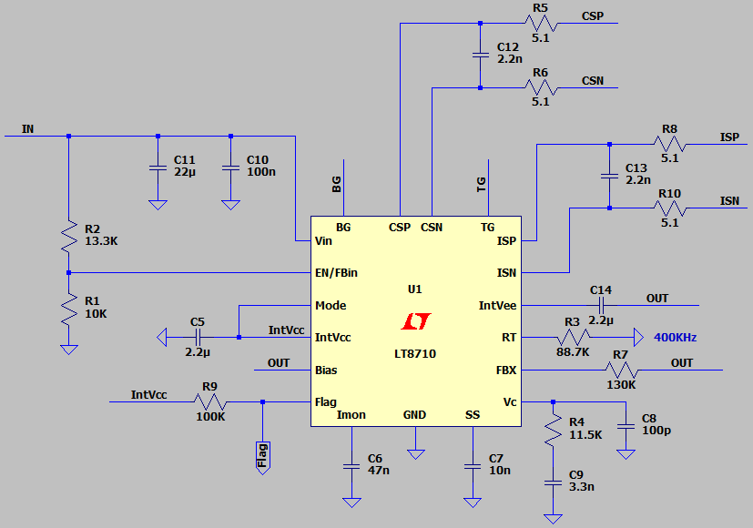
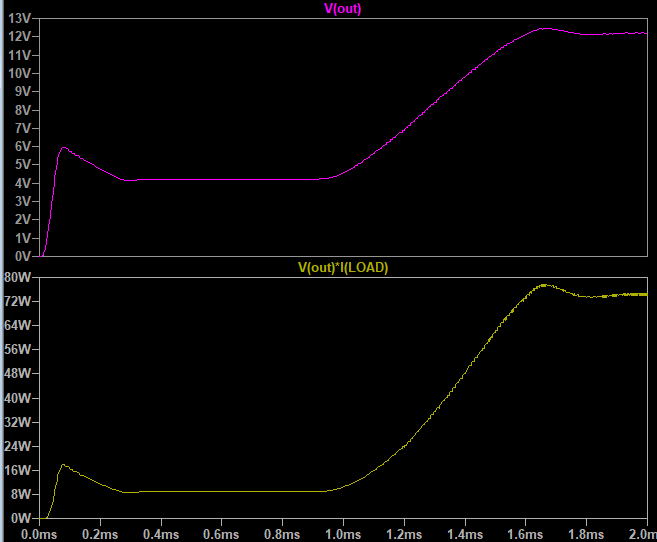

## Boost DC-DC Converter, Non-Isolated, Synchronous, Based on LT8710
Note: Default applications of datasheet.  
Note: An exercise to understand the DC-DC converter.  

### Features
- **Output:** 12V/70W
- **Input:** 4.5V to 9V
- **Peak Current Mode Control**
- **Controller IC:** LT8710

### Simulate
v1.0, Schematic  
  
  

v1.0, Plot  

### More Information
**Note**: [You can go here to download a single folder or file from GitHub.com](https://minhaskamal.github.io/DownGit/#/home)  
My GitHub Account: [GitHub.com/AliRezaJoodi](https://github.com/AliRezaJoodi)  