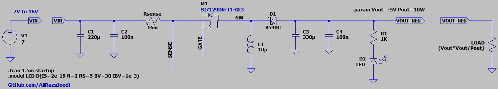
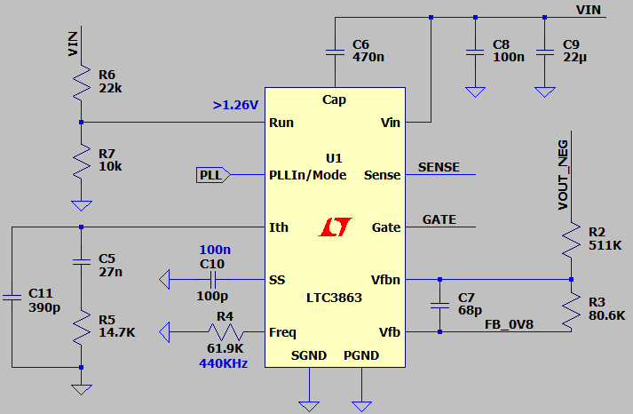
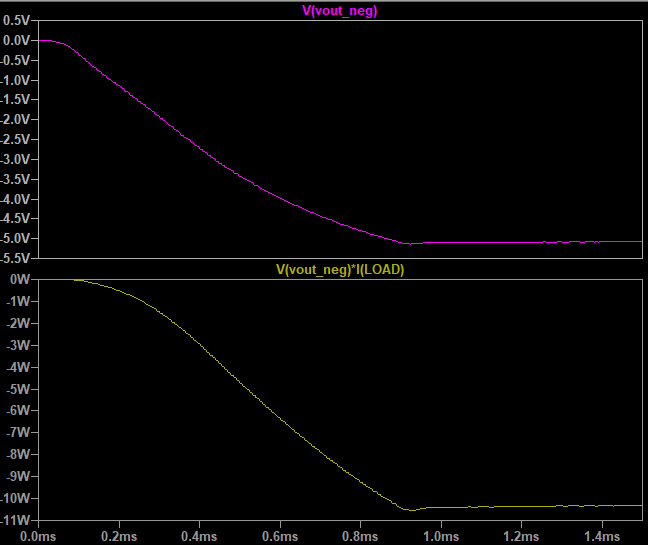

## Buck-Boost DC-DC Converter, Non-Isolated, Inverting, Non-Synchronous, Base on LTC3863
Note: The design is from the datasheet.  

### Features
- **Output:** -5V/10W
- **Input:** 7V to 16V
- **Peak Current Mode Control**
- **Controller:** LTC3863

### Simulate
v1.0, Schematic  
  
  

v1.0, Plot  

### More Information
**Note**: [You can go here to download a single folder or file from GitHub.com](https://minhaskamal.github.io/DownGit/#/home)  
My GitHub Account: [GitHub.com/AliRezaJoodi](https://github.com/AliRezaJoodi)  