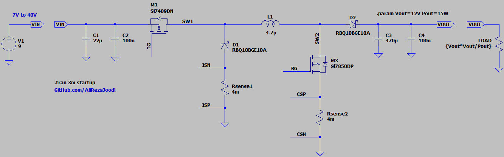
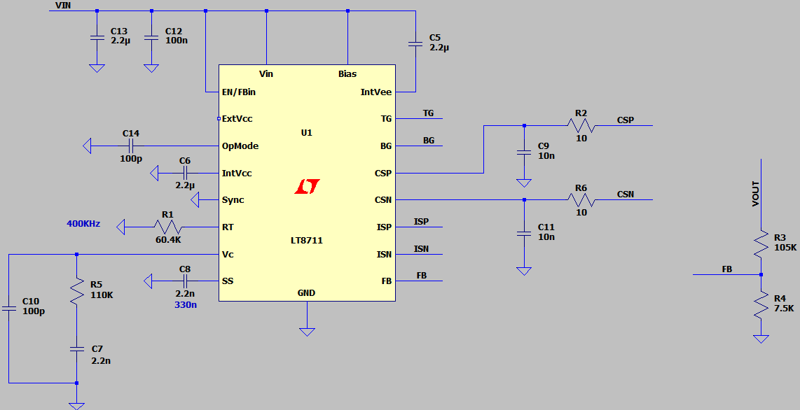
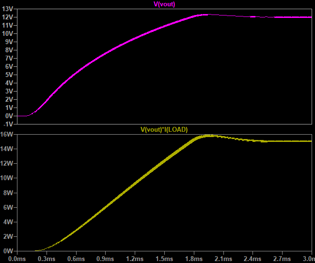

## Buck-Boost DC-DC Converter, Non-Isolated, Non-Inverting, Non-Synchronous, 2-Switch, Base on LT8711
Note: Default applications from LTspice for exercise

### Features
- **Output:** 12W/15W
- **Input:** 7V to 40V
- **Peak Current Mode Control**
- **Controller:** LT8711

### Simulate
v1.0, Schematic  
  
  

v1.0, Plot  

### More Information
**Note**: [You can go here to download a single folder or file from GitHub.com](https://minhaskamal.github.io/DownGit/#/home)  
My GitHub Account: [GitHub.com/AliRezaJoodi](https://github.com/AliRezaJoodi)  