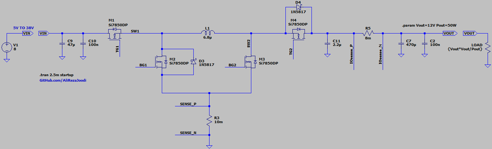
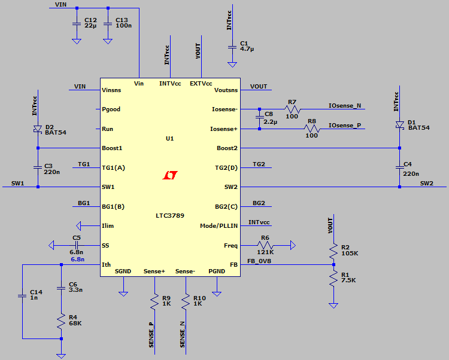
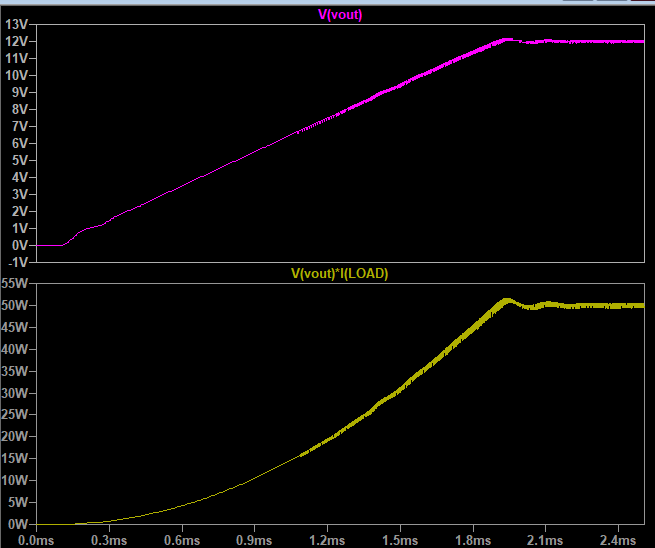

## Buck-Boost DC-DC Converter, Non-Isolated, Non-Inverting, Synchronous, 4-Switch, Base on LTC3789
Note: Default applications from LTspice for exercise

### Features
- **Output:** 12W/50W
- **Input:** 5V to 38V
- **Peak Current Mode Control**
- **Controller:** LTC3789

### Simulate
v1.0, Schematic  
  
  

v1.0, Plot  

### More Information
**Note**: [You can go here to download a single folder or file from GitHub.com](https://minhaskamal.github.io/DownGit/#/home)  
My GitHub Account: [GitHub.com/AliRezaJoodi](https://github.com/AliRezaJoodi)  