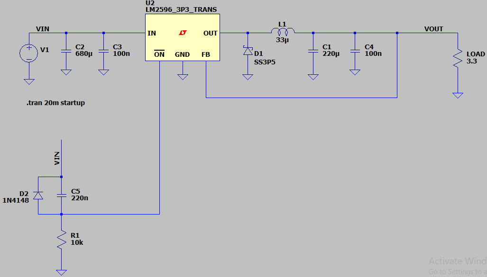
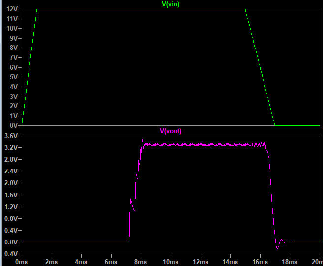

## Buck DC-DC Converter, Non-Isolated, Non-Synchronous, Based on LM2596 Module

### Simulate, 3.3V
v1.0, Schematic  
   

v1.0, Plot  

### More Information
**Note**: [You can go here to download a single folder or file from GitHub.com](https://minhaskamal.github.io/DownGit/#/home)  
My GitHub Account: [GitHub.com/AliRezaJoodi](https://github.com/AliRezaJoodi)  