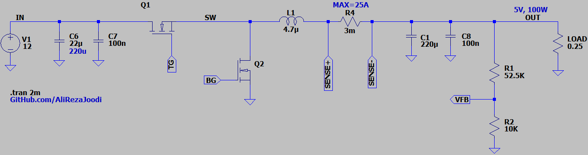
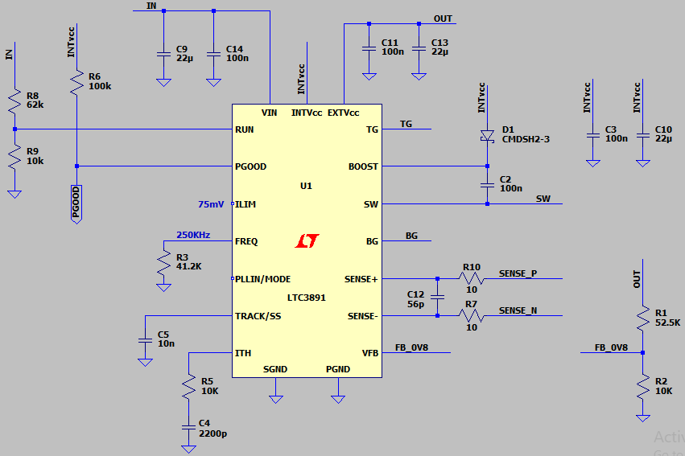
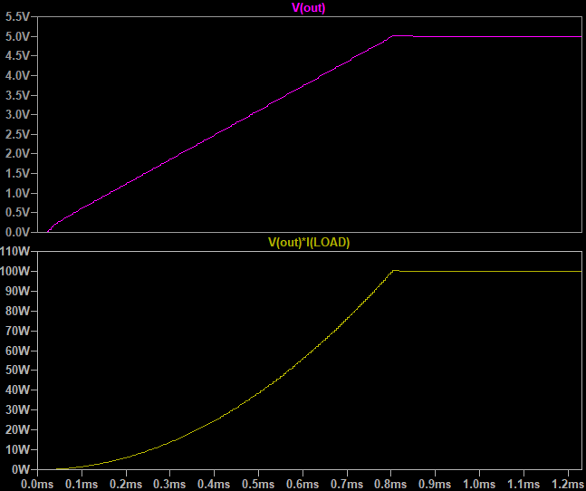

## Buck DC-DC Converter, Non-Isolated, Synchronous, Based on LTC3891
Note: The initial schematic was the default application provided by LTspice (v1.0).  
Note: I tried to create a clean schematic, and then tried to modify it for 5V/100W (v2.0).  

### Features, v2.0
- **Output:** 5V, 100W
- **Input:** 12V
- **Asynchronous**
- **Feedback Type:** Non-Isolated, Resistor Divider
- **Peak Current Mode Control**
- **Controller:** PWM controller based on LTC3891

### Simulate
v2.0, Schematic  
  
  

v2.0, Plot  

### More Information
**Note**: [You can go here to download a single folder or file from GitHub.com](https://minhaskamal.github.io/DownGit/#/home)  
My GitHub Account: [GitHub.com/AliRezaJoodi](https://github.com/AliRezaJoodi)  