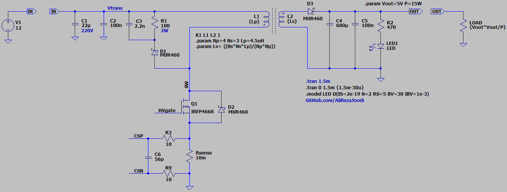
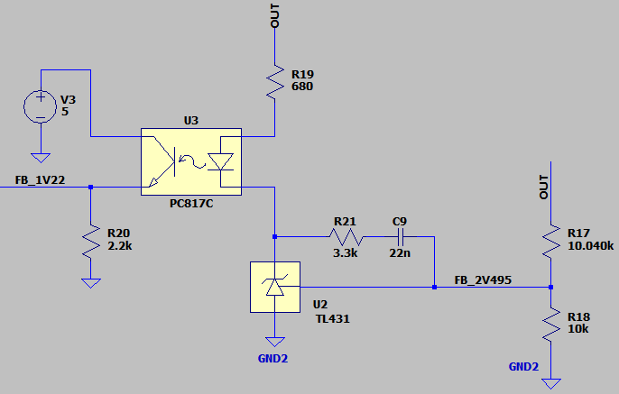
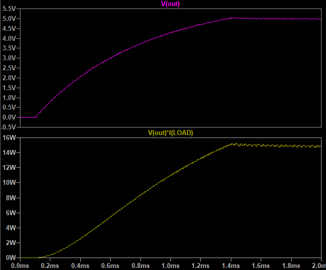
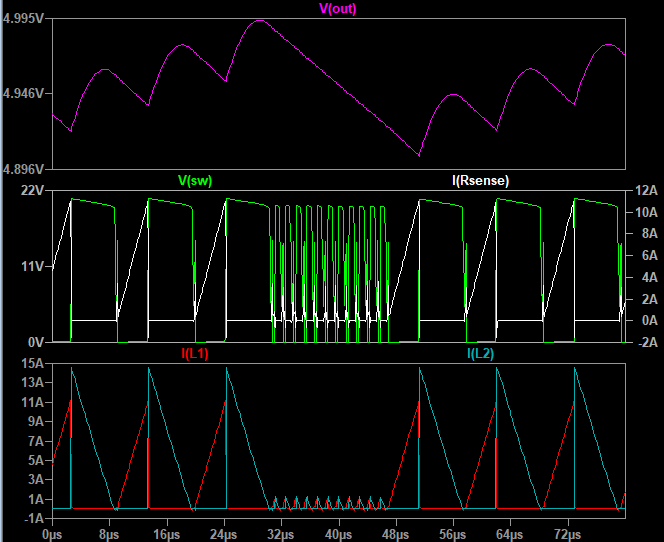

## Flyback DC-DC Converter, Isolated, Non-Synchronous, Based on LT3751

### Features
- **Output:** 5V/15W
- **Input:** 12V
- **Feedback Type:** Isolated FeedBack using Optocoupler and TL431
- **Discontinuous Conduction Mode (DCM)**
- **Peak Current Mode Control**
- **Controller:** PWM controller based on LT3751

### Simulate
v1.0, Schematic  
  
  

v1.0, Plot  
  
  

### More Information
**Note**: [You can go here to download a single folder or file from GitHub.com](https://minhaskamal.github.io/DownGit/#/home)  
My GitHub Account: [GitHub.com/AliRezaJoodi](https://github.com/AliRezaJoodi)  