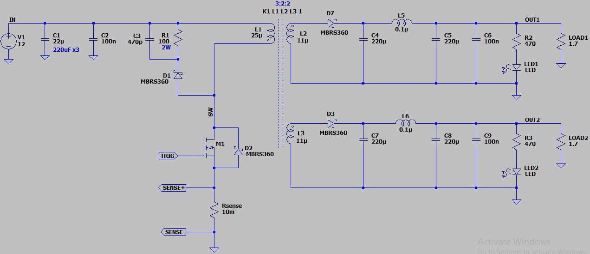
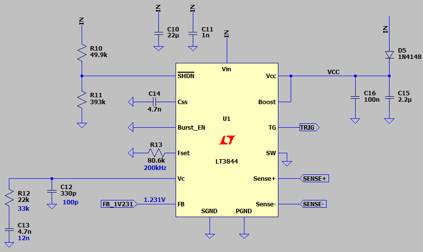
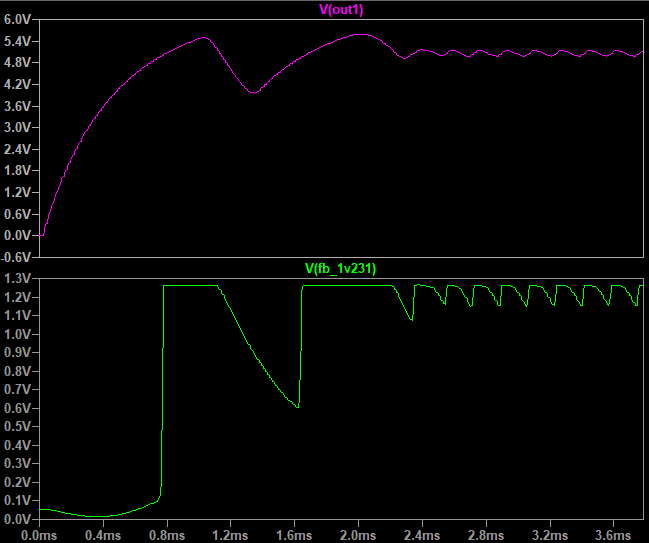

## Flyback DC-DC Converter, Isolated, Asynchronous, Based on LT3844

Note: Using LT3844 for isolated feedback is uncommon. 
Note: This example is for exercise purposes.
Note: The feedback needs to be better.  

### Features
- **Output:** 5V/15W x2, Isolated
- **Input:** 12V
- **Feedback Type:** Isolated FeedBack using Optocoupler and TL431
- **Controller:** PWM controller based on LT3844

### Simulate
v2.0, Schematic  
  
  
  

v2.0, Plot  

### More Information
**Note**: [You can go here to download a single folder or file from GitHub.com](https://minhaskamal.github.io/DownGit/#/home)  
My GitHub Account: [GitHub.com/AliRezaJoodi](https://github.com/AliRezaJoodi)  