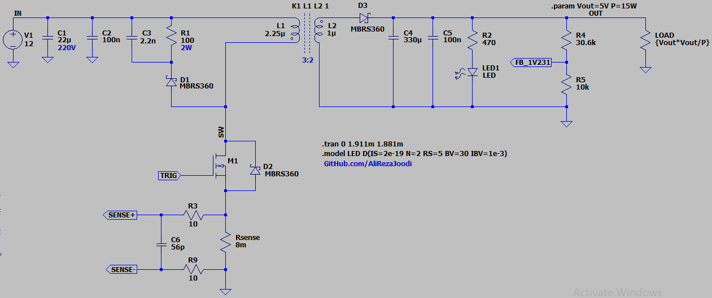
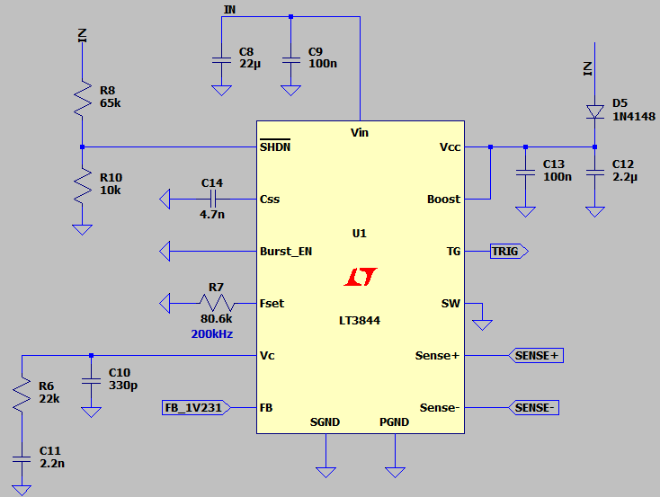
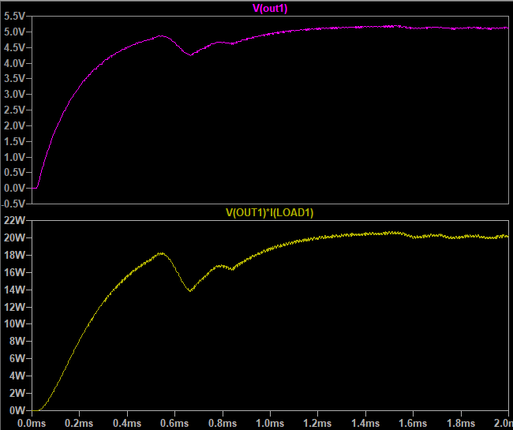

## Flyback DC-DC Converter, Non-Isolated, Asynchronous, Based on LT3844

This circuit is only for exercise.  
For a proper flyback design, it's better to use a controller IC that supports Discontinuous Conduction Mode (DCM) detection.  
Without DCM detection, like in the LT3844, adjusting the switching timing correctly becomes difficult.  

### Features
- **Output:** 5V/15W
- **Input:** 12V
- **Feedback Type:** Non-Isolated, Resistor Divider
- **Controller:** PWM controller based on LT3844

### Simulate
v1.0, Schematic  
  
  

v1.0, Plot  
  

### More Information
**Note**: [You can go here to download a single folder or file from GitHub.com](https://minhaskamal.github.io/DownGit/#/home)  
My GitHub Account: [GitHub.com/AliRezaJoodi](https://github.com/AliRezaJoodi)  