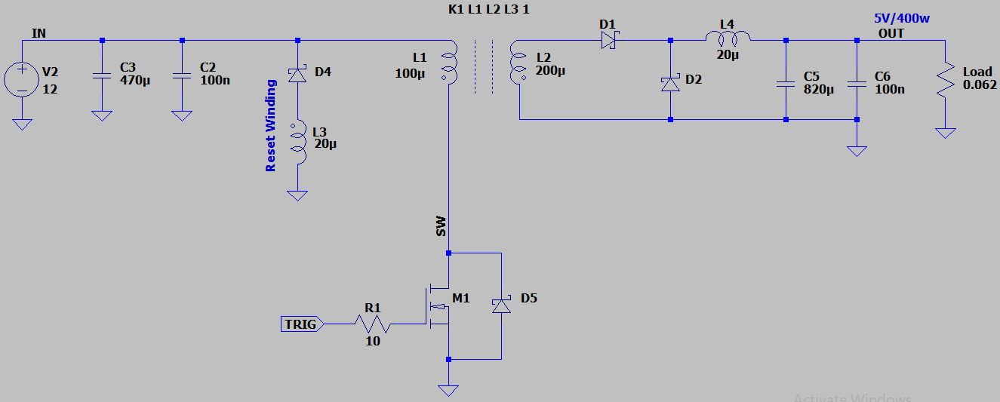
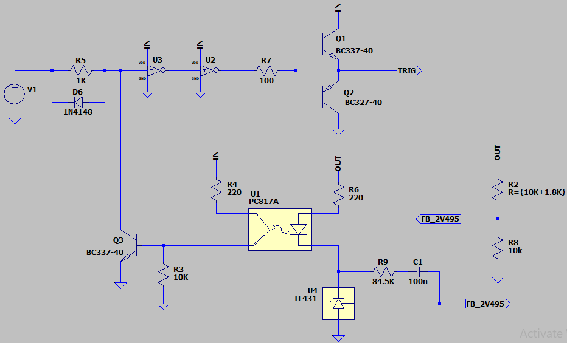
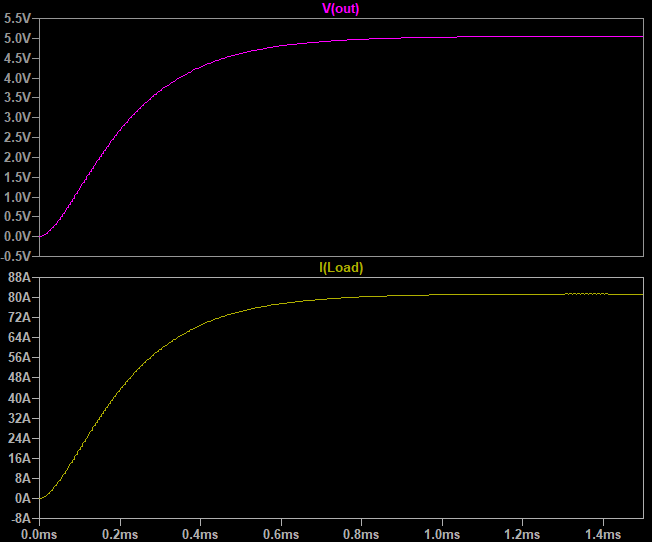

## Forward DC-DC Converter, Isolated, Asynchronous, Based on Not-Schmitt
Note: A simple example Just for exercises.  
Note: It's better to use a PWM controller IC.  

### Features, v2.1
- **Output:** Isolated 5V/400W
- **Input:** 12V

### Simulate, Reset Winding
v2.1, Schematic  
  
  

v2.1, Plot  

### More Information
**Note**: [You can go here to download a single folder or file from GitHub.com](https://minhaskamal.github.io/DownGit/#/home)  
My GitHub Account: [GitHub.com/AliRezaJoodi](https://github.com/AliRezaJoodi)  
