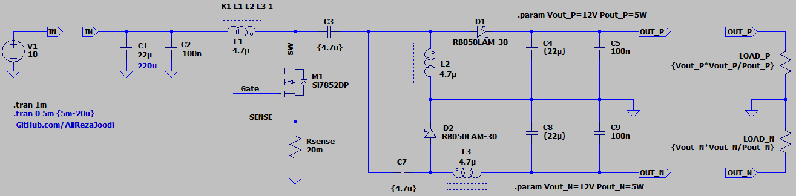
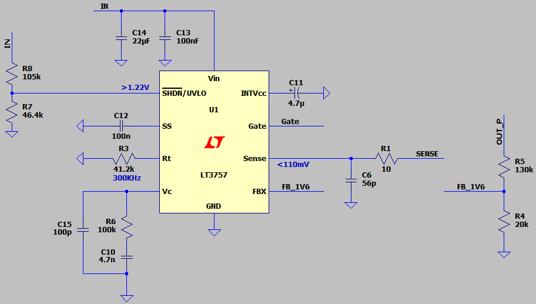
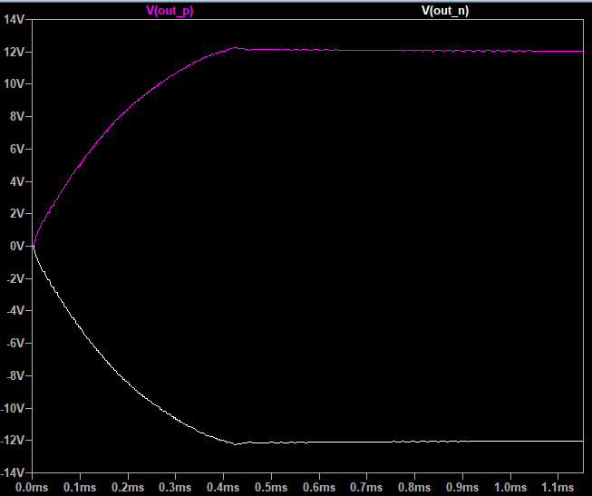

## SEPIC DC-DC Converter, Non-Isolated, Bipolar, Non-Synchronous, Based on LT3757
Note: The initial design is from the datasheet. I just adjusted it to fit my requirements.  
Note: An exercise to understand the DC-DC converter.  

### Features
- **Output2:** +12V/5W
- **Output1:** -12V/5W
- **Peak Current Mode Control**
- **Controller IC:** LT3757

### Simulate
v1.0, Schematic  
  
  

v1.0, Plot  

### More Information
**Note**: [You can go here to download a single folder or file from GitHub.com](https://minhaskamal.github.io/DownGit/#/home)  
My GitHub Account: [GitHub.com/AliRezaJoodi](https://github.com/AliRezaJoodi)  