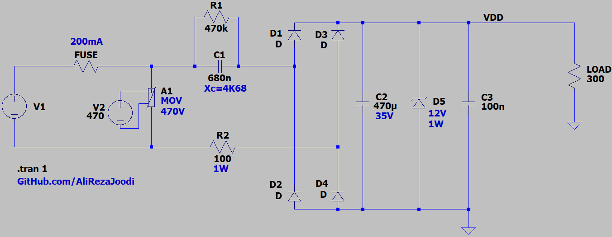
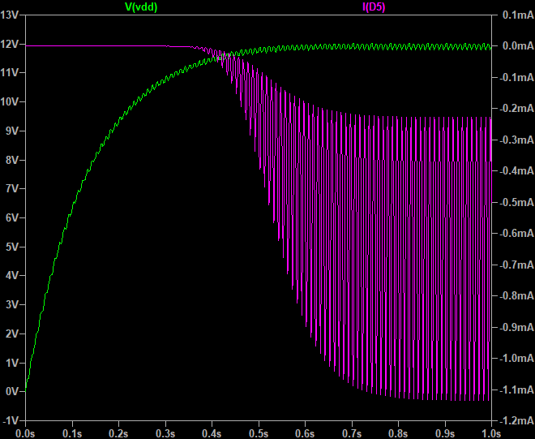
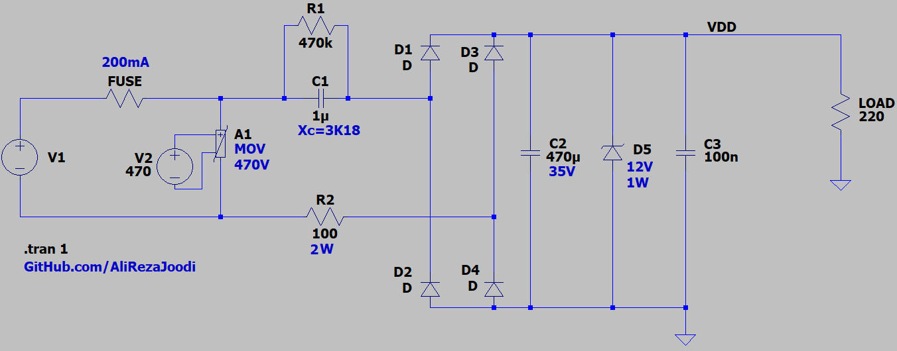
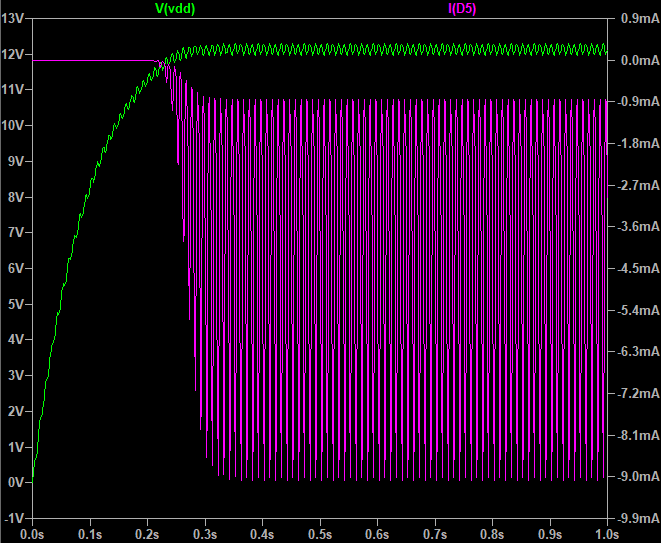

## Capacitive Power Supply
Note: $Xc={{1\over 2πfC}}$ (`f` is frequency and `C` is the capacitance)  

F=50Hz, C=470nF => Xc=6K77  
F=50Hz, C=680nF => Xc=4K68  
F=50Hz, C=1uF => Xc=3K18  
F=50Hz, C=4.7uF => Xc=678  

### Simulate, 12V/40mA
v1.0, Schematic  

v1.0, Plot  

### Simulate, 12V/55mA
v1.0, Schematic  

v1.0, Plot  

### Source
[Capacitor Impedance Calculator](https://www.allaboutcircuits.com/tools/capacitor-impedance-calculator/)
[Transformerless power supply calculator](http://www.nomad.ee/micros/transformerless/index.shtml)

### More Information
**Note**: [You can go here to download a single folder or file from GitHub.com](https://minhaskamal.github.io/DownGit/#/home)  
My GitHub Account: [GitHub.com/AliRezaJoodi](https://github.com/AliRezaJoodi)  
