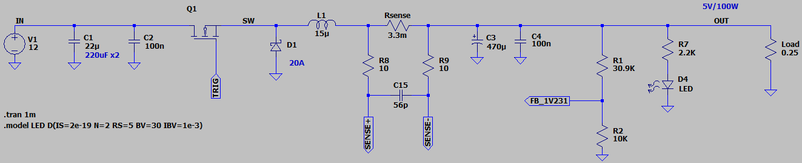
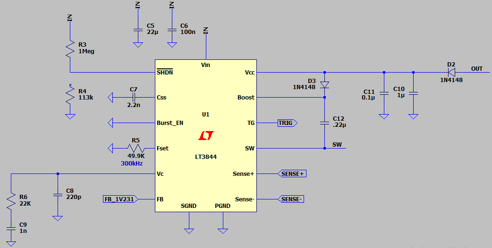
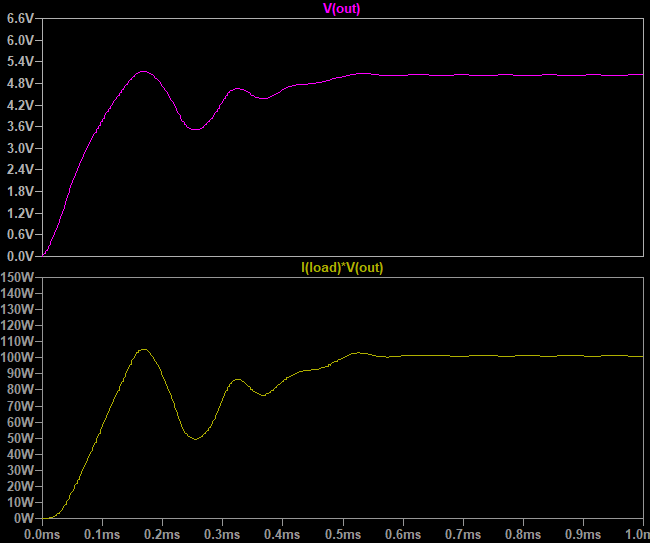

## Buck DC-DC Converter, Based on LT3844
Note: v1.0 is a default applications from LTspice.  
Note: An exercise to understand the DC-DC converter.  

### Features, v1.3
- **Output:** 5V/100W
- **Input:** 12V
- **Controller:** PWM controller based on LT3844

### Simulate
v1.3, Schematic  
  
  

v1.3, Plot  

### More Information
**Note**: [You can go here to download a single folder or file from GitHub.com](https://minhaskamal.github.io/DownGit/#/home)  
My GitHub Account: [GitHub.com/AliRezaJoodi](https://github.com/AliRezaJoodi)  