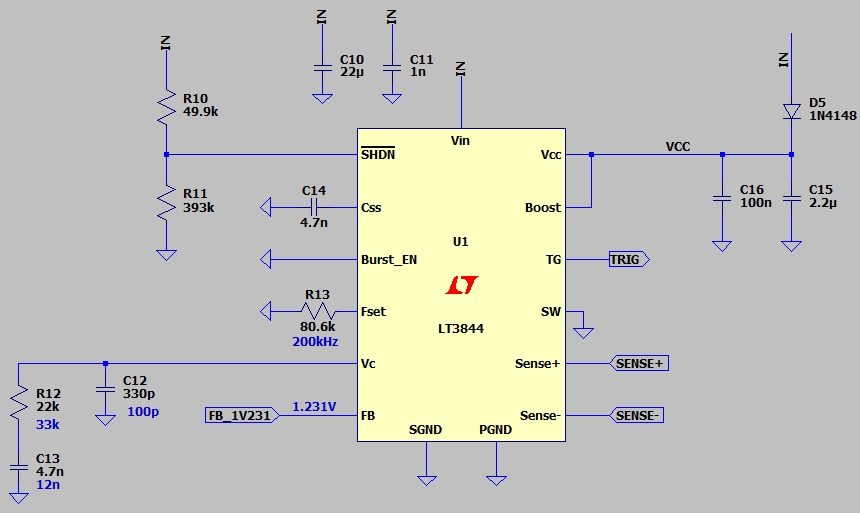

## Flyback DC-DC Converter, Isolated, Based on LT3844

Note: LT3844 is not common for isolated feedback. This is just an exercise.  
Note: Feedback based on Optocoupler and LT431 in v2.0 need to be better.  

### Simulate
v2.0, Schematic  
  
  
  

v2.0, Plot  

### More Information
**Note**: [You can go here to download a single folder or file from GitHub.com](https://minhaskamal.github.io/DownGit/#/home)  
My GitHub Account: [GitHub.com/AliRezaJoodi](https://github.com/AliRezaJoodi)  