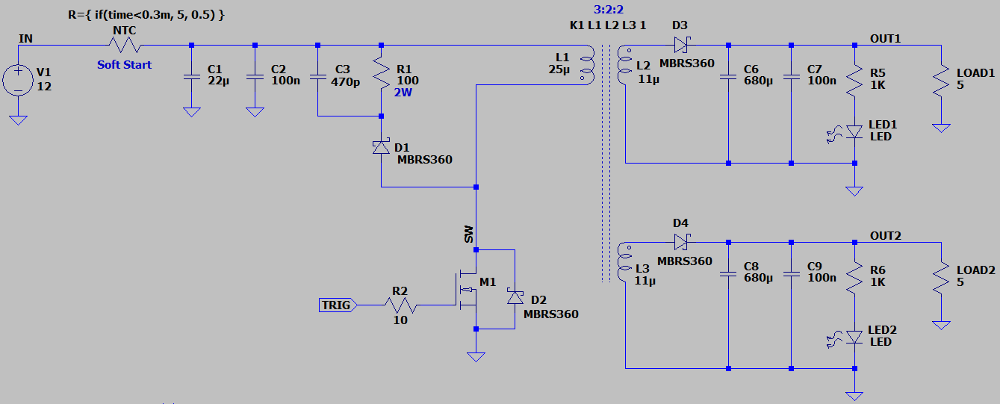
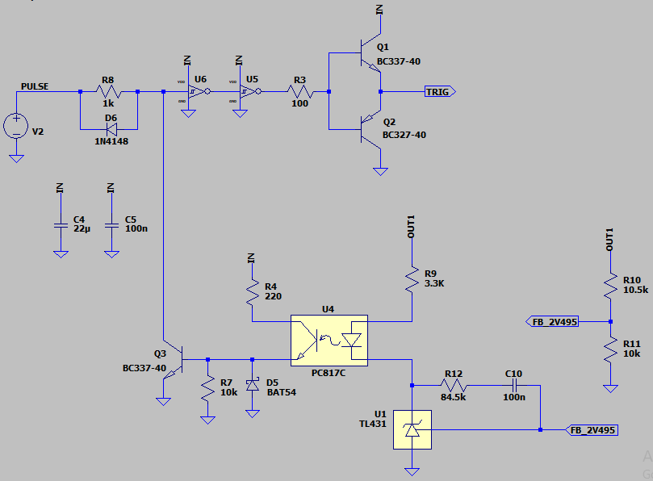
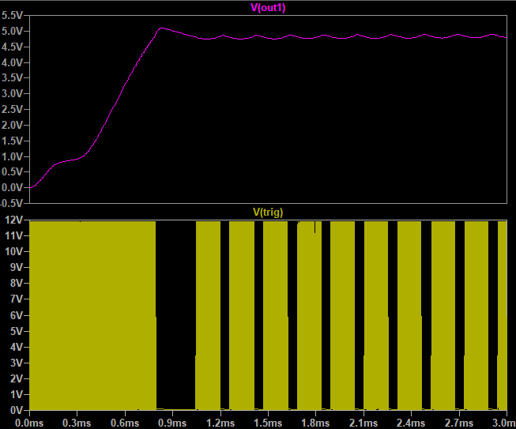

## Flyback DC-DC Converter, Isolated, Dual Low Power

### Photo
v1.0  

Note: A simple example Just for exercises.  
Note: Usable for low power.  
Note: It's better to use a PWM controller IC.  
Note: Using a toroidal ferrite for a flyback is not good.  

### Features, v2.0
- **Output:** Isolated Dual 5.1V, Low Power
- **Input:** 12V

### Simulate
v2.0, Schematic  
  
  

v2.0, Plot  

### Schematic
v1.0  

### More Information
**Note**: [You can go here to download a single folder or file from GitHub.com](https://minhaskamal.github.io/DownGit/#/home)  
My GitHub Account: [GitHub.com/AliRezaJoodi](https://github.com/AliRezaJoodi)  