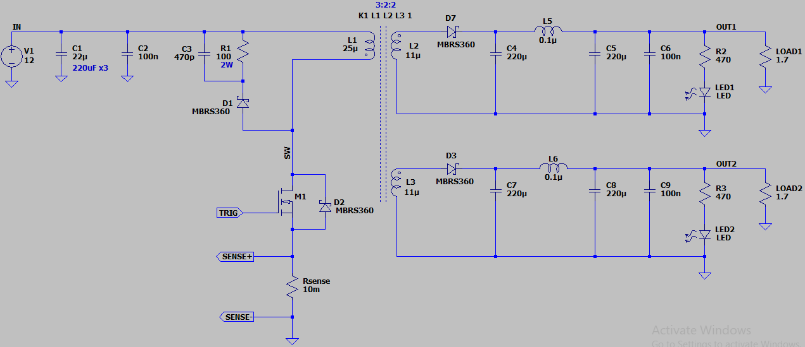
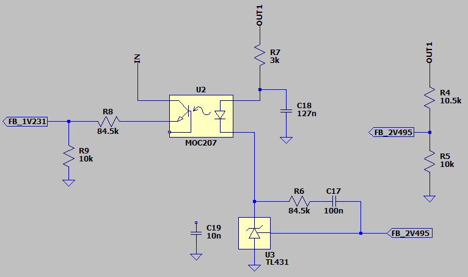

## DC-DC Converter, Isolated, Flyback, Based on LT3844, Dual

### Simulate
v3.0, Schematic  
  
  
  

v3.0, Plot  

#Upgrade
- Feedback based on Optocoupler and LT431 in v3.0 need to be better.

### More Information
**Note**: [You can go here to download a single folder or file from GitHub.com](https://minhaskamal.github.io/DownGit/#/home)  
My GitHub Account: [GitHub.com/AliRezaJoodi](https://github.com/AliRezaJoodi)  