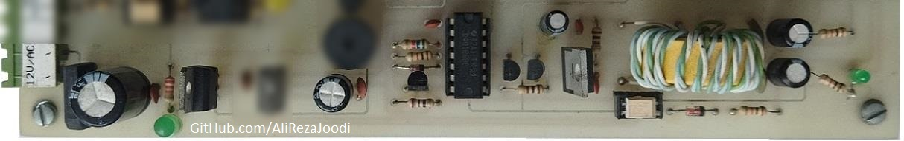
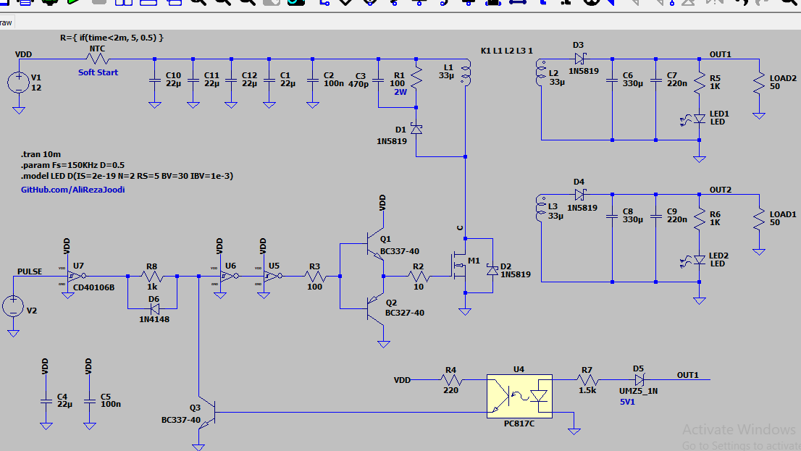
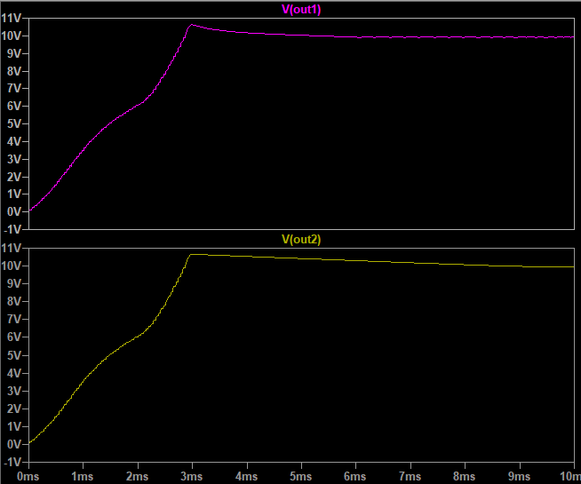
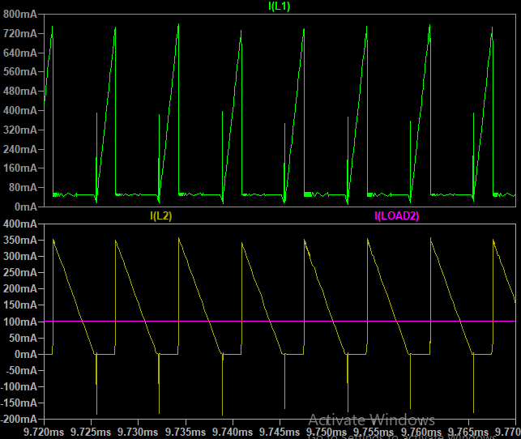
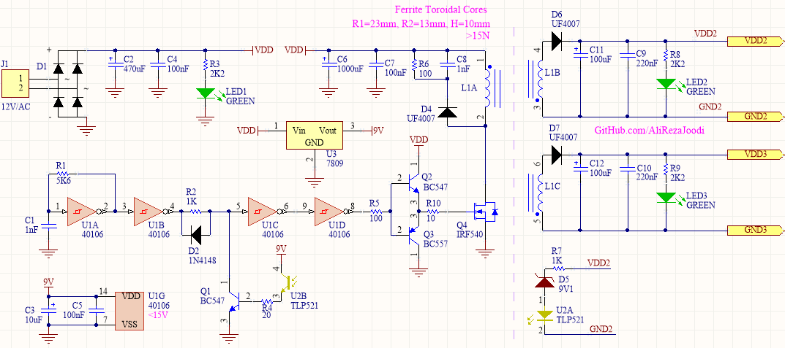

## DC-DC Converter, Isolated, Flyback, Dual Low Power
Note: A simple example for exercises

### Photo
v1.0  

### Simulate
v1.1, Schematic  

v1.1, Plot  

v1.1, Plot  

### Schematic
v1.0  

### Upgrad
- Use of PWM controller

### More Information
**Note**: [You can go here to download a single folder or file from GitHub.com](https://minhaskamal.github.io/DownGit/#/home)  
My GitHub Account: [GitHub.com/AliRezaJoodi](https://github.com/AliRezaJoodi)  