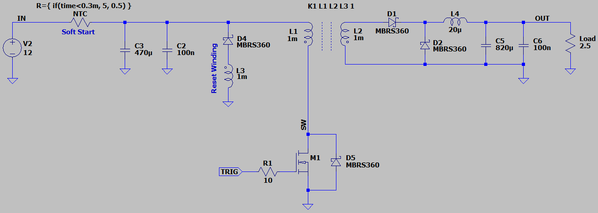
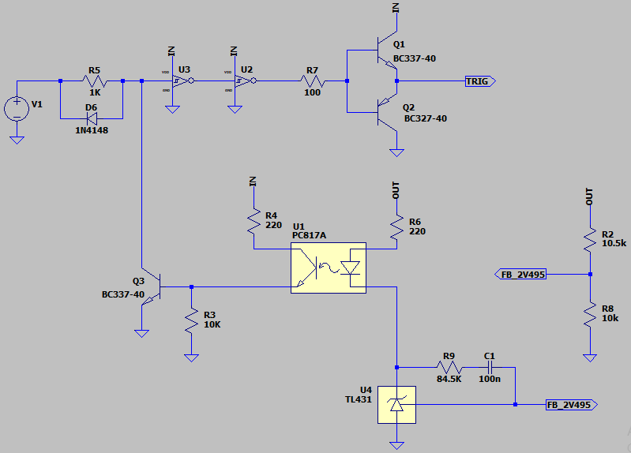
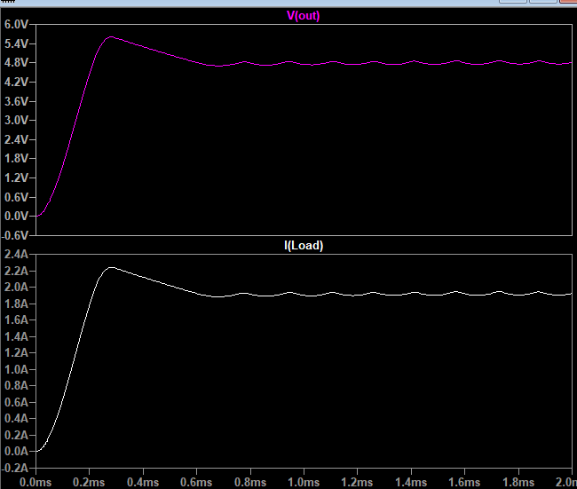

## DC-DC Converter, Isolated, Forward, Based on Not-Schmitt
Note: A simple example Just for exercises.  
Note: It's better to use a PWM controller IC.  

### Simulate, Reset Winding
v2.0, Schematic  
  
  

v2.0, Plot  

### More Information
**Note**: [You can go here to download a single folder or file from GitHub.com](https://minhaskamal.github.io/DownGit/#/home)  
My GitHub Account: [GitHub.com/AliRezaJoodi](https://github.com/AliRezaJoodi)  
