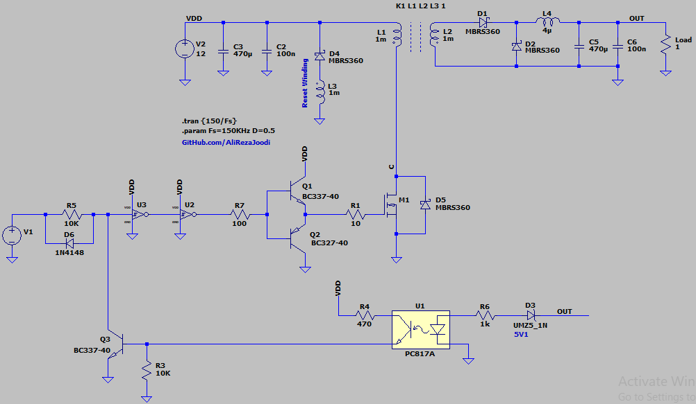
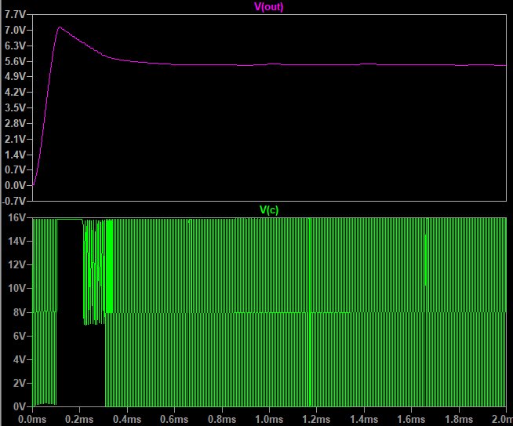

## DC To DC Converter, Isolated, Forward
Note: A simple example for exercises

### Simulate, Reset Winding
v1.0, Schematic  

v1.0, Plot  

### Upgrad
- Use of PWM controller

### More Information
**Note**: [You can go here to download a single folder or file from GitHub.com](https://minhaskamal.github.io/DownGit/#/home)  
My GitHub Account: [GitHub.com/AliRezaJoodi](https://github.com/AliRezaJoodi)  
