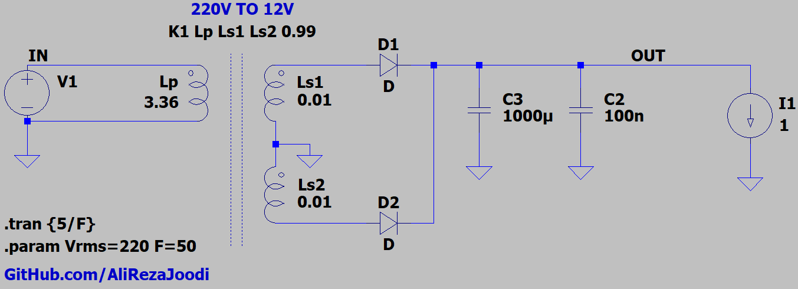
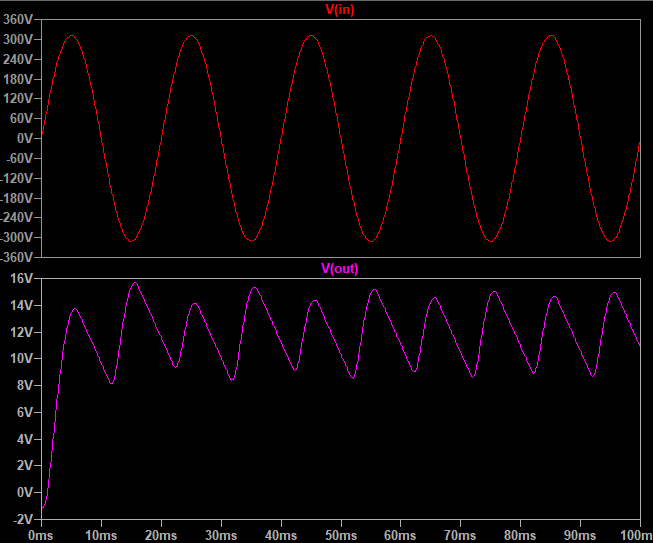
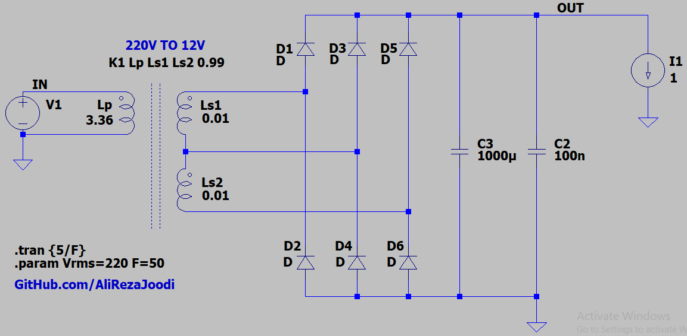
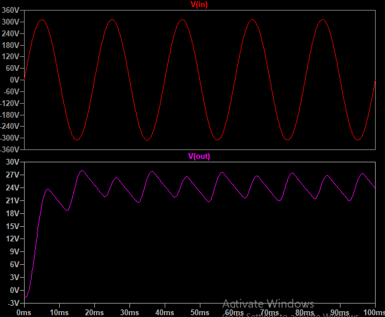

## Full Bridge Rectifier Using 3-Wire Transformer, 220V/AC to 12V/AC

### Simulate, 12V
v1.0, Schematic  

v1.0, Plot  

### Simulate, 24V
v1.0, Schematic  

v1.0, Plot  

### More Information
**Note**: [You can go here to download a single folder or file from GitHub.com](https://minhaskamal.github.io/DownGit/#/home)  
My GitHub Account: [GitHub.com/AliRezaJoodi](https://github.com/AliRezaJoodi) 