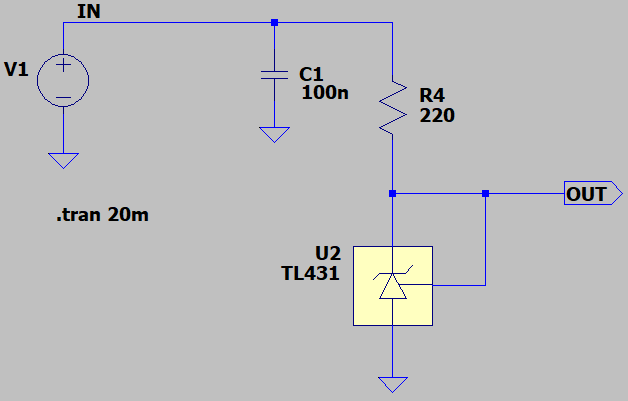
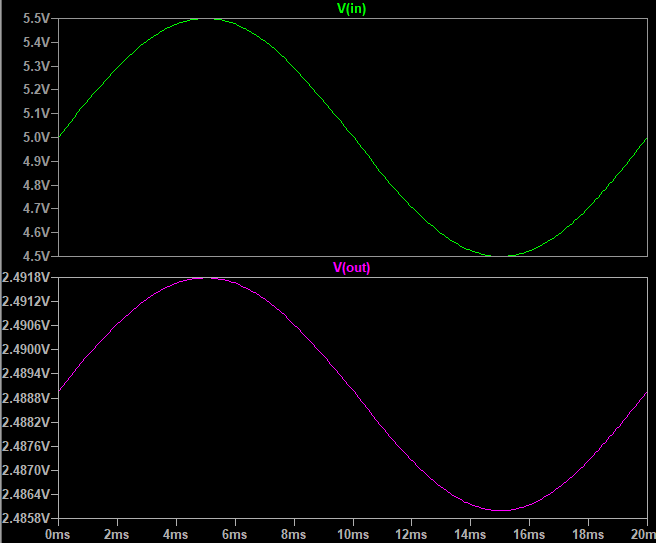
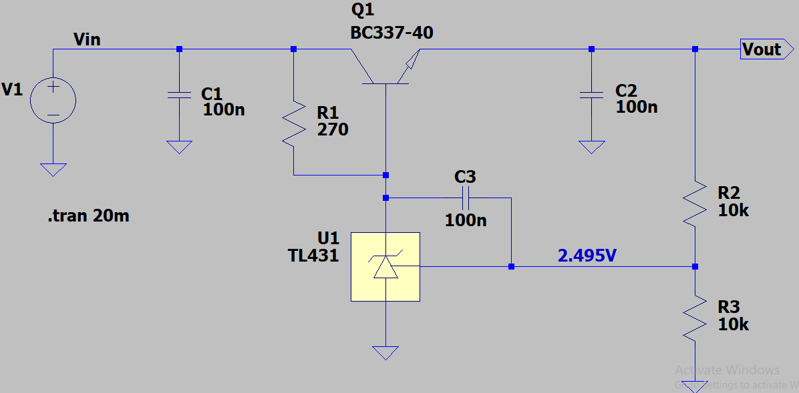
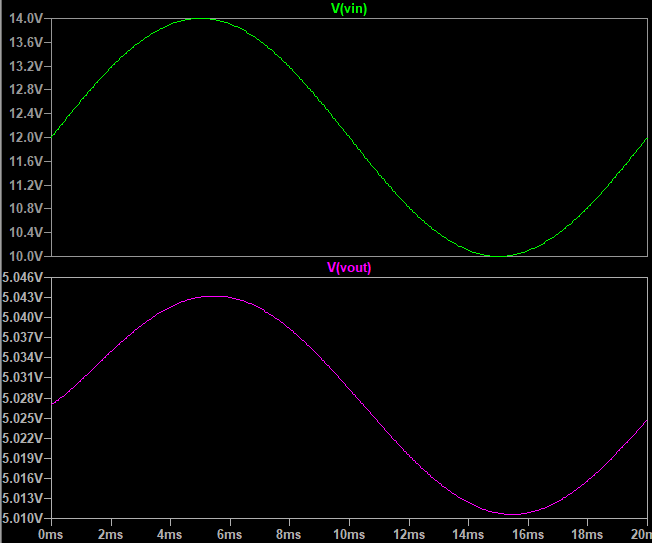

## Reference Voltage Using TL431
The TL431 is suitable for generating adjustable reference voltages.  
For applications requiring a fixed reference, it is recommended to use fixed-voltage reference ICs for better accuracy and reliability.  

### Simulate, Model 1
v1.0, Schematic  

v1.0, Plot  

### Simulate, Model 2
v1.0, Schematic  

v1.0, Plot  

### More Information
**Note**: [You can go here to download a single folder or file from GitHub.com](https://minhaskamal.github.io/DownGit/#/home)  
My GitHub Account: [GitHub.com/AliRezaJoodi](https://github.com/AliRezaJoodi)  
